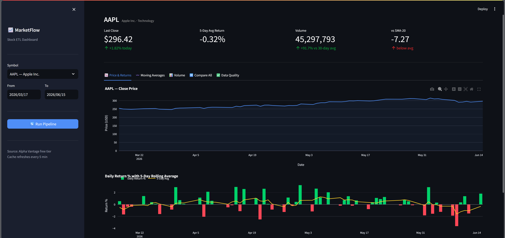

# MarketFlow 📈

> A production-quality incremental stock ETL pipeline — pulls live OHLCV data from Alpha Vantage, loads it into a PostgreSQL star schema, and serves an interactive Streamlit dashboard for analysis.


---

## Dashboard Preview



*Live dashboard showing AAPL price history, daily return bars, moving averages, volume analysis, and automated data quality checks — all powered by the ETL pipeline.*

---

## What It Does

| Phase | What happens |
|-------|-------------|
| **Extract** | Calls Alpha Vantage API for each symbol, fetches up to 100 trading days of OHLCV data, filters to only new rows (incremental) |
| **Transform** | Builds a star schema — `dim_company`, `dim_date`, and `fact_stock_prices` with computed `daily_return_pct` and `price_range` |
| **Load** | Upserts everything idempotently — re-runs never create duplicates |
| **Quality** | Runs 9 automated checks (null rates, row counts, duplicate keys, staleness, negative prices) — pipeline exits non-zero if any fail |
| **Dashboard** | Streamlit UI with interactive charts — price, returns, moving averages, volume, and a normalized comparison of all stocks |

---

## Architecture

```
┌─────────────────┐    ┌─────────────────┐    ┌──────────────────────────┐
│  Alpha Vantage  │───▶│  extract.py     │───▶│  raw.stock_prices        │
│  Free API       │    │  (incremental)  │    │  (PostgreSQL landing)    │
└─────────────────┘    └─────────────────┘    └────────────┬─────────────┘
                                                            │
                                                            ▼
                                               ┌──────────────────────────┐
                                               │  transform.py            │
                                               │  (star schema builder)   │
                                               └─────┬──────┬──────┬──────┘
                                                     │      │      │
                                          ┌──────────┘      │      └──────────┐
                                          ▼                  ▼                 ▼
                                  ┌──────────────┐  ┌────────────────┐  ┌──────────────┐
                                  │ dim_company  │  │fact_stock_price│  │  dim_date    │
                                  └──────────────┘  └───────┬────────┘  └──────────────┘
                                                            │
                                                            ▼
                                               ┌──────────────────────────┐
                                               │  Analytical SQL Views    │
                                               │  v_daily_returns         │
                                               │  v_moving_averages       │
                                               │  v_volume_analysis       │
                                               └──────────────────────────┘
                                                            │
                                                            ▼
                                               ┌──────────────────────────┐
                                               │  Streamlit Dashboard     │
                                               │  localhost:8501          │
                                               └──────────────────────────┘
```

---

## Star Schema

```
                     ┌────────────────────┐
                     │   dim_company      │
                     │────────────────────│
                     │ company_id  (PK)   │
                     │ symbol             │
                     │ company_name       │
                     │ sector             │
                     └─────────┬──────────┘
                               │ FK
                               ▼
┌──────────────────┐   ┌───────────────────────────┐
│   dim_date       │   │   fact_stock_prices        │
│──────────────────│   │───────────────────────────│
│ date_id    (PK)  │◀──│ fact_id        (PK)        │
│ full_date        │   │ company_id     (FK)        │
│ year             │   │ date_id        (FK)        │
│ quarter          │   │ open_price                 │
│ month            │   │ high_price                 │
│ week_of_year     │   │ low_price                  │
│ day_of_week      │   │ close_price                │
│ is_weekend       │   │ volume                     │
└──────────────────┘   │ price_range    (computed)  │
                       │ daily_return_pct           │
                       │ loaded_at                  │
                       └────────────────────────────┘
```

---

## Prerequisites

- [Docker Desktop](https://www.docker.com/products/docker-desktop/) (includes Docker Compose v2)
- An [Alpha Vantage API key](https://www.alphavantage.co/support/#api-key) — free tier is enough

---

## Quick Start

```bash
# 1. Clone the repo
git clone <repo-url> && cd MarketFlow

# 2. Add your API key to .env
cp .env.example .env
# Edit .env → set ALPHA_VANTAGE_API_KEY=<your-key>

# 3. Start PostgreSQL (creates schemas + views automatically)
docker compose up postgres -d

# 4. Run the ETL pipeline
docker compose up pipeline

# 5. Open the dashboard
docker compose up dashboard -d
# → http://localhost:8501
```

---

## Dashboard Features

Open **http://localhost:8501** after starting the dashboard service.

### Sidebar
| Control | What it does |
|---------|-------------|
| **Symbol dropdown** | Switch between AAPL, MSFT, GOOGL, AMZN, TSLA, META, NVDA, JPM |
| **Date range** | Filter all charts to any time window within the loaded data |
| **Run Pipeline** | Fetches today's prices from Alpha Vantage and refreshes the UI |

### KPI Cards
Shows 4 live metrics for the selected symbol: last close price, 5-day average return, today's volume vs. 30-day average, and distance from SMA-20.

### Tabs

| Tab | Charts |
|-----|--------|
| **Price & Returns** | Area chart of close price + green/red daily return bars + 5-day rolling average line |
| **Moving Averages** | Close price overlaid with SMA-20 (dotted) and SMA-50 (dashed) |
| **Volume** | Volume bars (green = above avg, blue = below) + 30-day average line + intraday range % |
| **Compare All** | All stocks normalized to 100 at the period start — see which outperformed |
| **Data Quality** | Live QC score and table of all 9 automated checks with values |

---

## Environment Variables

| Variable | Default | Description |
|----------|---------|-------------|
| `ALPHA_VANTAGE_API_KEY` | *(required)* | Your Alpha Vantage API key |
| `POSTGRES_DB` | `marketflow` | Database name |
| `POSTGRES_USER` | `marketflow_user` | DB username |
| `POSTGRES_PASSWORD` | `marketflow_pass` | DB password |
| `POSTGRES_HOST` | `postgres` | Hostname — use `postgres` in Docker, `localhost` outside |
| `POSTGRES_PORT` | `5432` | PostgreSQL port (exposed as `5433` on the host) |

---

## Incremental Loading

Each pipeline run only fetches new data — not the full history:

1. Before calling the API, `extract.py` checks `raw.stock_prices` for the most recent `trade_date` already loaded (`get_latest_loaded_date`).
2. First run → requests `outputsize=compact` (last 100 trading days).
3. Subsequent runs → same `compact` request, then `filter_new_records` drops everything already in the table.
4. All inserts use `ON CONFLICT DO UPDATE` — re-runs are fully idempotent.
5. The transform layer upserts the same way — partial or repeated runs never create duplicates.

---

## Running the Pipeline

### Via Docker Compose (recommended)

```bash
# Full pipeline run
docker compose up pipeline

# Specific symbols only
docker compose run --rm pipeline python -m src.orchestrate AAPL MSFT

# Just the extraction step
docker compose run --rm pipeline python -m src.extract

# Just the transformation step
docker compose run --rm pipeline python -c "
from src.extract import get_db_connection
from src.transform import transform_all
conn = get_db_connection()
print(transform_all(conn))
conn.close()
"
```

### Locally (without Docker)

```bash
pip install -r requirements.txt
export POSTGRES_HOST=localhost
export ALPHA_VANTAGE_API_KEY=your_key_here
PYTHONPATH=. python -m src.orchestrate
```

---

## Running Tests

```bash
# All tests (fully mocked — no DB or API needed)
PYTHONPATH=. pytest tests/ -v

# With coverage report
PYTHONPATH=. pytest tests/ -v --cov=src --cov-report=term-missing

# Single file
PYTHONPATH=. pytest tests/test_extract.py -v
```

All 21 tests use mocks — no live database or API connection required.

---

## SQL Analytical Views

Views live in `sql/views/` and are auto-applied on first DB startup via `sql/init/03_views.sql`.

### `v_daily_returns`

Daily close price and return %, plus a 5-day rolling average computed with a window function.

```sql
SELECT symbol, full_date, daily_return_pct, rolling_5d_return_avg
FROM warehouse.v_daily_returns
WHERE symbol = 'AAPL'
ORDER BY full_date DESC LIMIT 30;
```

### `v_moving_averages`

SMA-20 and SMA-50 for each stock, plus the distance of close price from SMA-20 (mean-reversion signal).

```sql
-- Stocks trading significantly above their 20-day MA
SELECT symbol, full_date, close_price, sma_20, price_vs_sma20
FROM warehouse.v_moving_averages
WHERE full_date = CURRENT_DATE - INTERVAL '1 day'
  AND price_vs_sma20 > 5
ORDER BY price_vs_sma20 DESC;
```

### `v_volume_analysis`

Daily volume vs. 30-day rolling average, plus intraday price range % as a volatility proxy.

```sql
-- Unusual volume spikes (>200% of 30-day avg)
SELECT symbol, full_date, volume, avg_volume_30d, volume_vs_avg_pct
FROM warehouse.v_volume_analysis
WHERE volume_vs_avg_pct > 200
ORDER BY full_date DESC, volume_vs_avg_pct DESC;
```

---

## Data Quality Checks

`quality_checks.py` runs 9 automated checks after every pipeline run. A failure causes `orchestrate.py` to exit with code 1, failing any CI/CD gate.

| Check | Verifies | Threshold |
|-------|----------|-----------|
| `raw_row_count` | Raw table is not empty | > 0 rows |
| `fact_row_count` | Fact table is not empty | > 0 rows |
| `dim_company_count` | Company dimension is populated | > 0 rows |
| `null_close_price_pct` | No null close prices | 0% |
| `null_open_price_pct` | No null open prices | 0% |
| `duplicate_fact_keys` | No duplicate (company_id, date_id) pairs | 0 |
| `stale_data_days` | Data loaded recently | ≤ 3 days ago |
| `negative_prices` | No negative open or close prices | 0 rows |
| `zero_volume_pct` | Zero-volume rows are rare | < 5% |

---

## Tracked Symbols

| Symbol | Company | Sector |
|--------|---------|--------|
| AAPL | Apple Inc. | Technology |
| MSFT | Microsoft Corporation | Technology |
| GOOGL | Alphabet Inc. | Technology |
| AMZN | Amazon.com Inc. | Consumer Cyclical |
| TSLA | Tesla Inc. | Consumer Cyclical |
| META | Meta Platforms Inc. | Technology |
| NVDA | NVIDIA Corporation | Technology |
| JPM | JPMorgan Chase & Co. | Financial Services |

To add more: extend `DEFAULT_SYMBOLS` in [src/extract.py](src/extract.py) and `COMPANY_METADATA` in [src/transform.py](src/transform.py).

---

## Project Structure

```
MarketFlow/
├── docker-compose.yml              # postgres + pipeline + dashboard services
├── Dockerfile                      # Python 3.11-slim image
├── .env.example                    # Template — copy to .env and fill in your key
├── requirements.txt                # Pinned Python dependencies
├── assets/
│   └── dashboard.png               # Dashboard screenshot
├── .streamlit/
│   └── config.toml                 # Dark theme + server settings
├── sql/
│   ├── init/
│   │   ├── 01_raw_schema.sql       # raw schema + raw.stock_prices
│   │   ├── 02_warehouse_schema.sql # star schema tables
│   │   └── 03_views.sql            # analytical views (auto-applied on startup)
│   └── views/
│       ├── v_daily_returns.sql
│       ├── v_moving_averages.sql
│       └── v_volume_analysis.sql
├── src/
│   ├── extract.py                  # Alpha Vantage extraction + incremental load
│   ├── transform.py                # raw → star schema
│   ├── load.py                     # thin extract → transform wrapper
│   ├── quality_checks.py           # 9 automated QC checks
│   ├── orchestrate.py              # main entrypoint: extract → transform → QC
│   └── dashboard.py                # Streamlit dashboard
└── tests/
    ├── test_extract.py
    ├── test_transform.py
    ├── test_load.py
    └── test_quality_checks.py      # 21 tests, fully mocked
```

---

## Connecting to the Database Directly

The PostgreSQL database is exposed on `localhost:5433`:

```bash
# psql via Docker
docker compose exec postgres psql -U marketflow_user -d marketflow

# Or with any GUI (DBeaver, TablePlus, pgAdmin):
# Host:     localhost
# Port:     5433
# Database: marketflow
# User:     marketflow_user
# Password: marketflow_pass
```

---

## Notes on Alpha Vantage Free Tier

- Free tier allows **25 API requests per day** and ~5 per minute.
- With 8 symbols the pipeline uses 8 requests per run — within the daily limit.
- If a symbol hits the rate limit you will see a `"Note"` or `"Information"` key in the response — the pipeline logs a warning and skips that symbol gracefully, without failing.
- For larger symbol lists, add `time.sleep(12)` between requests in `extract_all()` to stay within the 5 req/min cap.
